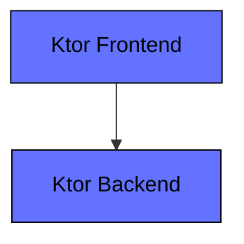
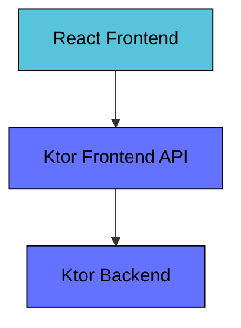

# Ktor Sandbox
This repository contain sandbox projects to showcase features of the [Ktor framework](https://ktor.io).

## Examples
Read details about the examples in their respective project roots.

* [CRUD Exposed](./ktor-crud-exposed)
* [CRUD Ktorm](./ktor-crud-ktorm)
* [CRUD JOOQ](./ktor-crud-jooq)
* [OAuth2 Token Relay](./ktor-oauth2-token-relay) - WIP
* [OTEL Observability](./ktor-otel-observability)
* [Kafka CQRS](./ktor-kafka-cqrs)

## Architecture
Ktor is a lightweight framework for building client and server applications. It was created by
[JetBrains](https://www.jetbrains.com) to champion the features of the Kotlin programing language and the
asynchronous programing model based on their Coroutines framework.

Ktor is a very modular framework with an explicit configuration style where you are in full control of the
setup of your application. It has a plugin based configuration model where features are enabled by adding the
corresponding plugin to the application setup. Unlike similar frameworks it does not have an
[IoC-container](https://martinfowler.com/articles/injection.html) by default. This means it does not support
traditional Dependency Injection.

The examples typically consists of a `Frontend` and a `Backend` application.

If the frontend is a JavaScript application then there is often also a `Frontend API` application.

## Use case
Most examples implement a "hello world" style logic that returns a greeting message when the user inputs a name.

* A user inputs the name "John" and clicks "Submit"
* The system generates a greeting "Hello John!" back to the user
