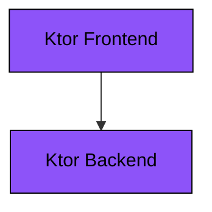
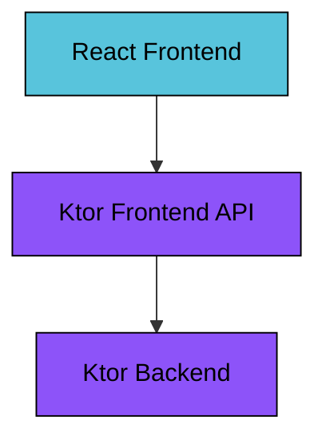

# Ktor Sandbox

This repository contain sandbox projects to showcase features of the [Ktor framework](https://ktor.io).

All examples are written in [Kotlin](https://kotlinlang.org) and built using [Gradle](https://gradle.org).

## Examples
Read details about the examples in their respective project roots.

* [REST API](./apps/ktor-api-rest)
* [GraphQL API](./apps/ktor-api-graphql)
* [CRUD Exposed JDBC](./apps/ktor-crud-exposed-jdbc)
* [CRUD Exposed DAO](./apps/ktor-crud-exposed-dao)
* [CRUD Ktorm](./apps/ktor-crud-ktorm)
* [CRUD JOOQ](./apps/ktor-crud-jooq)
* [OAuth2 Token Relay](./apps/ktor-oauth2-token-relay)
* [OTEL Observability](./apps/ktor-otel-observability)
* [Kafka CQRS](./apps/ktor-kafka-cqrs)

## Architecture
[Ktor](https://ktor.io) is a lightweight framework for building applications for the
[JVM runtime](https://en.wikipedia.org/wiki/Java_virtual_machine). Ktor was created by
[JetBrains](https://www.jetbrains.com) to champion the features of the
[Kotlin programing language](https://kotlinlang.org) and the asynchronous programing model based on their
Coroutines framework.

Ktor is a very modular framework with an explicit configuration style where you are in full control of the
setup of your application. It has a plugin based configuration model where features are enabled by adding the
corresponding plugin to the application setup. Unlike similar frameworks it does not have an
[IoC-container](https://martinfowler.com/articles/injection.html) by default. This means it does not support
traditional Dependency Injection out of the box, though there are plugins to enable Dependency Injection
functionality (e.g. the [Koin framework](https://insert-koin.io)).

The examples typically consists of a `Frontend` and a `Backend` application.

If the frontend is a JavaScript application then there is often also a `Frontend API` application.

## Use case
Most examples implement a "hello world" style logic that returns a greeting message when the user inputs a name.

* A user inputs the name "John" and clicks "Submit"
* The system generates a greeting "Hello John!" back to the user
