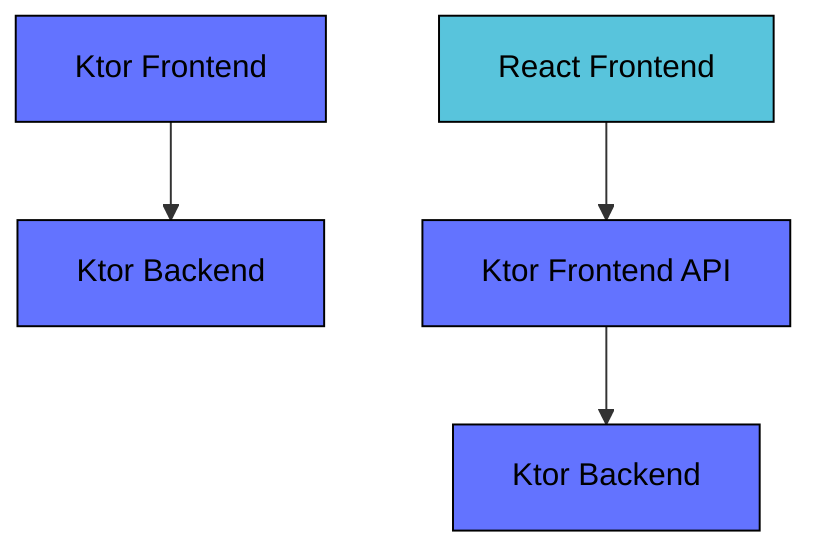

# Ktor Sandbox
This repository contain sandbox projects to showcase features of the Ktor framework.

## Use case
Most examples implement a "hello world" style logic that returns a greeting message when the user inputs a name.

* A user inputs the name "John" and clicks "Submit"
* The system generates a greeting "Hello John!" back to the user

The examples typically consists of a "frontend" and a "backend" application. If the frontend is a JavaScript
application then there is often also a "frontend API" application.

## Examples
Read details about the examples in their respective project roots.

* [CRUD Exposed](./ktor-crud-exposed)
* [OAuth2 Client React](./ktor-oauth2-client-react)
* [OTEL Observability](./ktor-otel-observability)
* [Kafka CQRS](./ktor-kafka-cqrs)
