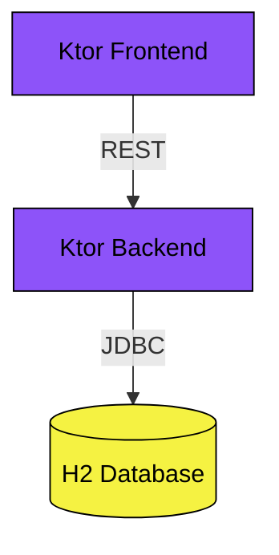

# Ktor CRUD JOOQ

This example shows a CRUD architecture using the JOOQ framework.

## Prerequisites

* Java Runtime - e.g. [Temurin JDK](https://adoptium.net), [OpenJDK](https://openjdk.org) or [Oracle JDK](https://www.oracle.com/java)
* [NodeJS Runtime](https://nodejs.org)
* [NPM](https://www.npmjs.com) or [Yarn](https://yarnpkg.com)
* [Docker](https://www.docker.com)

## Run

Start Backend application:
```bash
../gradlew :ktor-crud-jooq:backend:run
```

Start Frontend application:

```bash
../gradlew :ktor-crud-jooq:frontend:run
```

## Architecture

The example consists of a `Frontend` and a `Backend` application.



### Backend

The Backend is a REST API application based on Ktor.

### Frontend

The Frontend is a web application based on Thymeleaf and Ktor.
