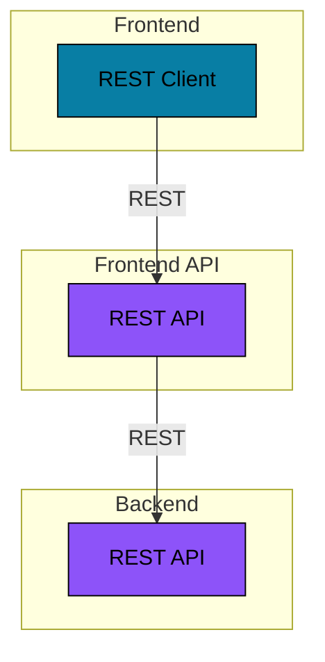

# Ktor REST API

This example shows a React frontend and Ktor REST API.

## Architecture



### Backend

The Backend is a REST API application based on Ktor and with an OAuth2 Resource Server security configuration.

```bash
?
```

This Ktor application is protected by Spring Security using the OAuth2 Authorization Code Grant login flow.

Look at the `WebSecurityConfig` class and the `application.yml` files for more details on the security configuration.

### Frontend API

The Frontend API is a REST API application based on Ktor and with an OAuth2 Client security configuration.

```bash
?
```

This Ktor application is protected by Spring Security using the OAuth2 Authorization Code Grant login flow.

Look at the `WebSecurityConfig` class and the `application.yml` files for more details on the security configuration.

### Frontend

The Frontend is a JavaScript web application based on ReactJS and using the React Bootstrap framework.

```bash
cd ./frontend
yarn install
yarn start
```

When the React application is loaded into the browser it will call the REST API to fetch data on the currently
logged-in user. If there is an active user session then the API will return the data. If there is no user session then
the API will return an _401 Unauthorized_ HTTP status, as well at a redirect URL in the _Location_ HTTP header. The app
will redirect the browser to the URL to initiate the OAuth2 login flow.
